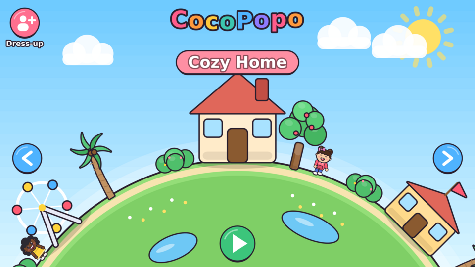
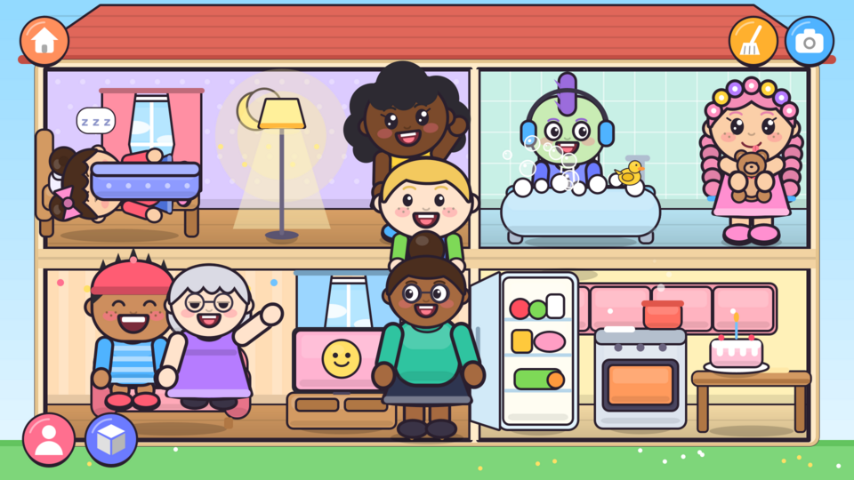
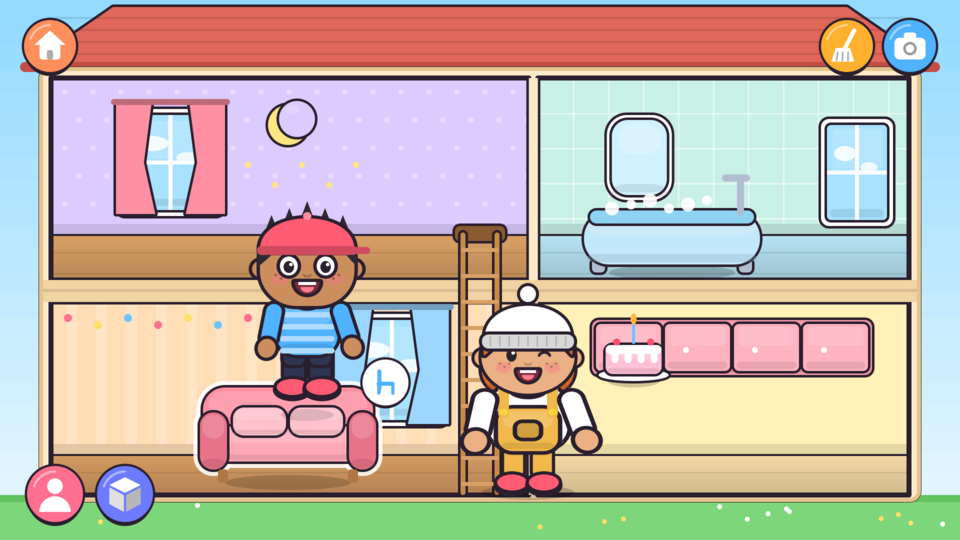
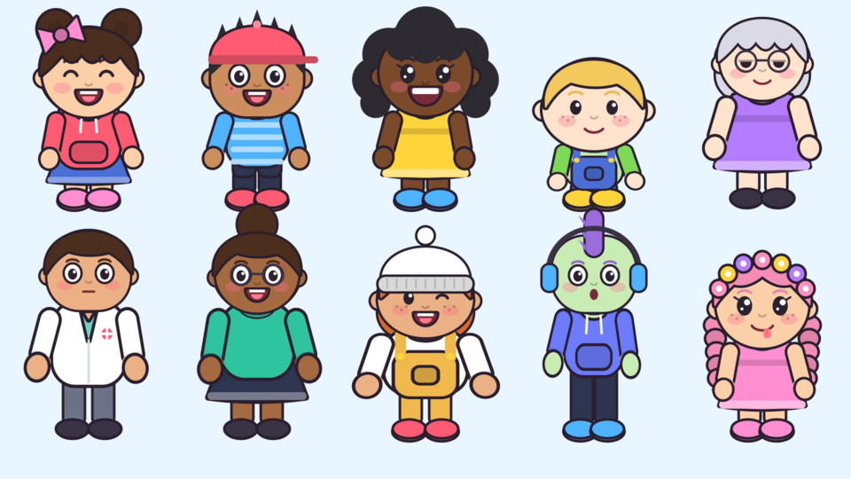
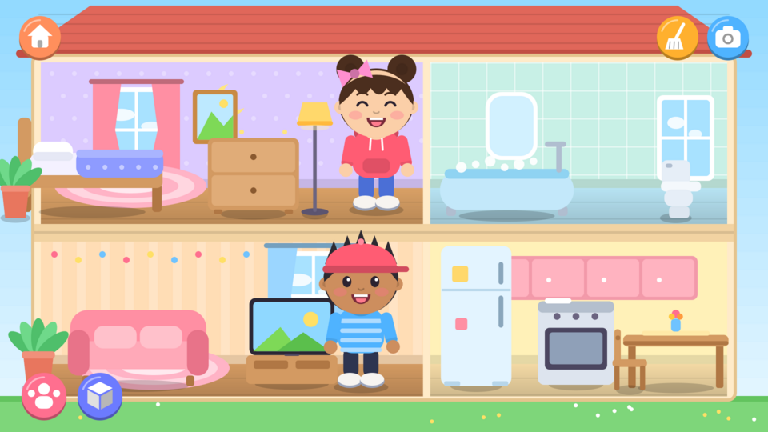
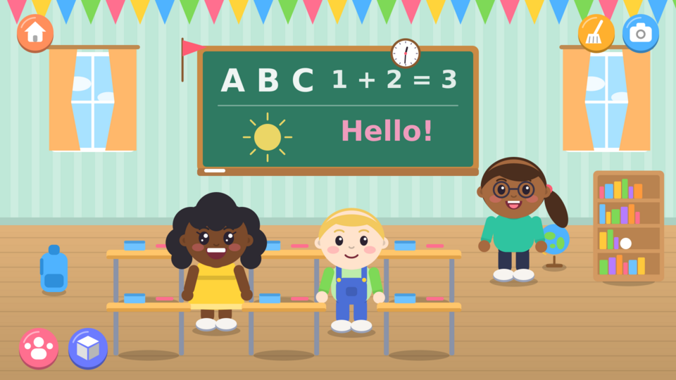
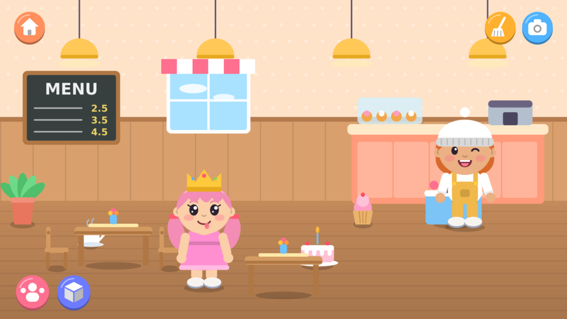
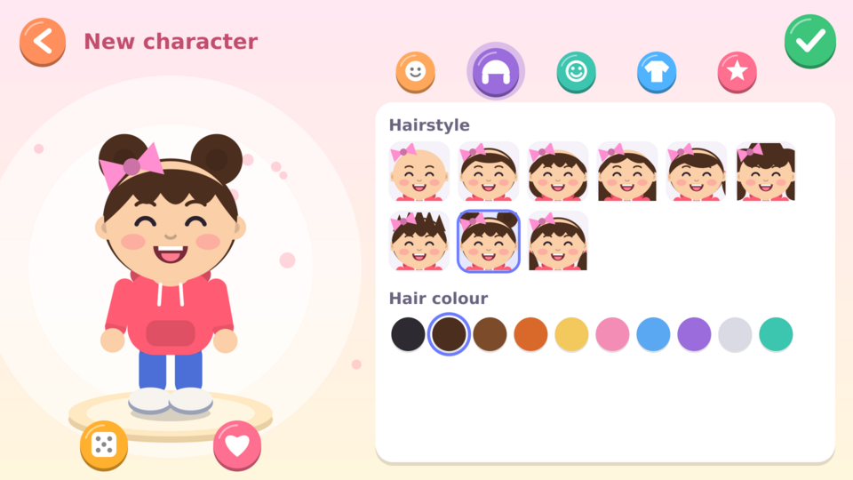

# CocoPopo

A personal Toca Life World–style dollhouse game for Android. Pick a place on the map, build your own
characters, and play: drag people and furniture around, make them emote, take photos.

| Rotating world | Life in the house |
|---|---|
|  |  |

| Drag targets glow | New cast |
|---|---|
|  |  |

| Home | School |
|---|---|
|  |  |

| Café | Character creator |
|---|---|
|  |  |

## Install

**Godot version (current):** download `CocoPopo.apk` from the
[latest release](https://github.com/ozsoreq/CocoPopo/releases/tag/cocopopo-latest) — it is rebuilt automatically by
GitHub Actions on every push that touches `godot/`.

**Classic version:** `release/CocoPopo-classic.apk` is the original hand-drawn Java build (Android 5.0+, landscape).
Copy it to your phone/tablet and open it (allow "install unknown apps" for your file manager/browser).

## How to play

See [docs/REQUIREMENTS.md](docs/REQUIREMENTS.md) for the full feature list.

* **World** – drag to spin the planet (or use the arrows); it snaps to a place. Tap the building or ▶ to go in.
* **Characters live** – they breathe, blink, look around, wave, dance and wander. Select one and tap the floor to make it walk there.
* **Sit & sleep** – drop a character on a chair, sofa, bench, toilet, swing or wheelchair to sit; on a bed to sleep.
* **Hold & eat** – drop an item on a character to hand it over; tap a character holding food to eat it bite by bite.
* **Gravity & toss** – things fall to the floor, small items can be put on tables or flicked so they bounce. Tap a ball to kick it.
* **Tap props** – lamp on/off, TV channels, fridge door, stove, gift box surprise, rocket launch, trees drop fruit, bushes hide toys.
* **Glow targets** – while dragging, whatever you can interact with glows and shows a badge (sit, sleep, bath, slide, give, put in, hug, ride on shoulders, bounce).
* **Walk & use** – select a character and tap any prop: it walks there (using the ladder at home) and uses it.
* **Bath, slide, car** – drop a character in the tub, at the top of the slide, or in the car (then tap the floor to drive).
* **Containers** – drop items into the fridge, cart, crate, backpack, tub or an open gift; tap to take them out.
* **Friends** – drop one character on another to hug, or on their head for a shoulder ride.
* **Makeover** – 6 body types, 3 head shapes, eyes that look at things, expressions, 13 hairstyles, skirts/shorts, coloured shoes, hats.

* **Places** – Cozy Home (2-storey cutaway), School, Hospital, Market, Café, Park, Beach, Funfair. The pink button (top-left) opens the character creator.
* **Selection menu** – tapping something also shows: edit (characters), emote, flip, bigger, smaller, copy, delete.
* **Bottom-left buttons** – people tray (your characters + 10 presets + “New”) and item tray (55+ props in 5 categories).
  Tap a card to add it, or drag it straight into the scene.
* **Character creator** – skin, 9 hairstyles, hair colours, eyes, mouths, 6 outfits, colours and accessories. 🎲 randomises, ♥ saves to *My characters*.
* **Camera** (top-right) saves a UI-free picture to `Pictures/CocoPopo`. **Broom** resets the place (tap twice).
* Every place remembers how you left it.

## Godot version (`godot/`)

The game is being rebuilt in **Godot 4.7.1** (GDScript). Characters are cutout rigs made of separate tinted SVG parts
(legs, shoes, torso, arms, mittens, head, hair, hats) driven by code-side bones; faces are drawn live for expressions.

* Open `godot/project.godot` in Godot 4.7.1 (standard build) and press Play to try it on your computer.
* **The world is painted live by Godot** (`godot/scripts/world/`): every place, the world map, clouds, sun and
  scenery are drawn at runtime with a small smooth-vector toolkit (`paint.gd`: anti-aliased shapes, gradients,
  soft shadows and glows) — no image files — and animate (drifting clouds, turning sun, waves, bobbing boat,
  spinning Ferris wheel, heartbeat monitor). Places live in `backdrop.gd`, map buildings in `vignettes.gd`.
* Props, character parts and icons are SVGs in `godot/art/`, generated by the GDScript art generator in
  `godot/tools/art/` (`prop_art.gd`, `char_art.gd`, `icon_art.gd`). Edit those and regenerate: in the editor open
  `tools/art/export_art.gd` and use *File → Run*, or run `tools/export_art.sh`.
* **Deeper play (2.6):** drop eggs, bread, tomatoes or corn on the stove and bananas, strawberries or apples in the
  blender to cook; pets (cat, dog, bunny) follow friends, eat, nap in their bed and sleep at night; the moon/sun
  button switches day and night (lamps light up, stars come out, characters get sleepy); drop a character on a
  door or bus stop to send them — and whatever they hold — to another place.
* Sounds are generated by `tools/gen_sfx.py`.
* `.github/workflows/android-godot.yml` builds and signs the APK (no local Android SDK needed).
* **Dress-up editor:** from the world map (*Dress-up*), the tray's *Create* card, or the pencil on a selected character.
  Body, head, skin, freckles, 13 hairstyles, hair colour, eyes, mouth, tops, bottoms, shoes, hats and colours; dice for a
  random look, heart to save to *My characters* (shown first in the tray).
* Test runs: `godot --path godot -- --test=smoke` (gameplay), `--test=editor` (dress-up), `--test=depth` (cooking, pets, night, doors), `--test=shots --out=/tmp` (screenshots).

The signing key `godot/android/cocopopo-release.keystore` (password `cocopopo`) is committed on purpose so every
CI build installs as an update — fine for a personal project, don't reuse it for anything published.

## Building the classic version

No Gradle/Android Studio needed – everything is drawn in code with `android.graphics`, so there are no image assets.

```bash
sudo apt-get install aapt apksigner dalvik-exchange zipalign android-sdk-platform-23   # once
./build.sh                                                                            # -> release/CocoPopo.apk
```

The first build creates `build/cocopopo.keystore` (git-ignored). Keep it if you want future builds to install
over the existing app; an APK signed with a different key must be uninstalled first.

### Desktop preview (no emulator)

`tools/preview.sh g_map g_scene_home g_editor_1 …` renders screens to `preview-out/*.png` using a tiny Java2D
stand-in for `android.graphics` (`tools/preview`). `tools/preview.sh smoke` runs a scripted headless playthrough.

## Layout

```
app/src/main/java/com/cocopopo/app/
  Game.java      all screens, input, world map, life simulation, tray, editor, persistence
  Life.java      rules: seats, beds, surfaces, floors, food, interactive props
  Synth.java     procedural sound effects
  Avatar.java    character renderer     Look.java   appearance + presets
  PropArt.java   55+ item drawings      Scenes.java location backgrounds + map icons
  Icons.java     button glyphs          Gfx.java    drawing helpers
  GameView.java / MainActivity.java     Android glue
```
